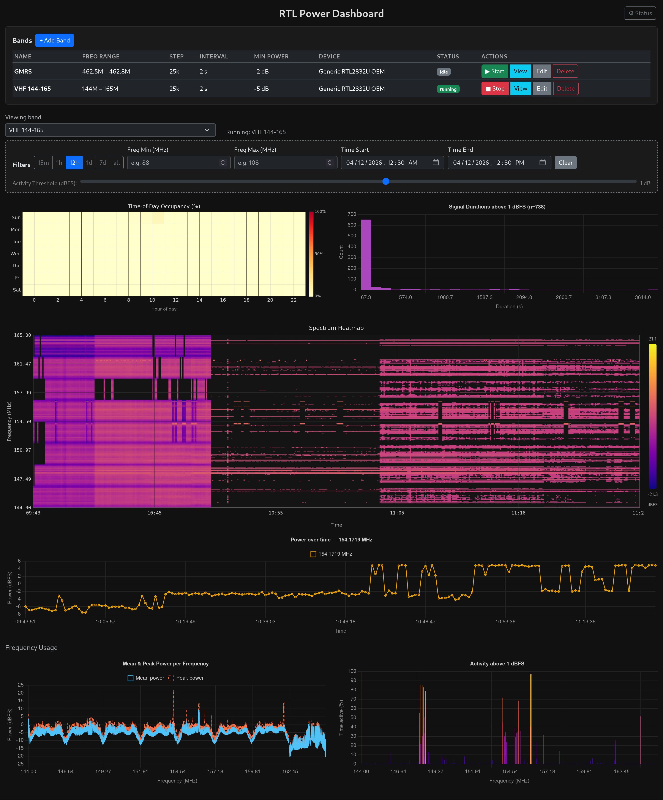

# RTL Power Dashboard

A self-hosted RF spectrum monitoring tool. Connects to any USB SDR receiver supported by `rtl_power`, continuously scans user-defined frequency bands, stores measurements in a local SQLite database, and presents them as interactive charts in a web browser.



---

## What it does

- Scan multiple frequency bands on a configurable interval
- Store only readings above a per-band power threshold — keeping the database lean
- Automatically cycle multiple bands on the same device
- Prune old data automatically to cap storage
- Visualise spectrum as a heatmap, spectrum line, activity %, time-of-day occupancy, signal durations, top channels, and more
- Manage bands and filters entirely from the browser — no config file edits required after initial setup

---

## Quick start

### Docker (recommended)

Build the image once:

```bash
docker build -t localhost/rtl-app:latest .
```

Run:

```bash
docker compose up
```

Open `http://localhost:8050` in a browser.

The SQLite database is persisted in `./data` on the host. USB SDR devices are passed through automatically via `/dev/bus/usb`.

### Local (Python + Node)

```bash
python -m venv venv && source venv/bin/activate
pip install -r requirements.txt
cd ui && npm install && npm run build && cd ..
python run.py
```

Open `http://localhost:8050`.

---

## Demo mode

No hardware? Run with pre-recorded data:

```bash
DEMO_MODE=true python run.py
```

---

## Documentation

| Doc | Contents |
|---|---|
| [docs/overview.md](docs/overview.md) | Architecture, data model, configuration reference |
| [docs/user-guide.md](docs/user-guide.md) | Setup, band configuration, dashboard walkthrough, tips |
| [docs/developer-guide.md](docs/developer-guide.md) | Project structure, backend internals, frontend patterns, API reference, contributing |

---

## Requirements

- Any USB SDR receiver compatible with `rtl_power` (RTL-SDR, Nooelec, etc.)
- `rtl-sdr` tools on the host (`sudo apt install rtl-sdr` on Debian/Ubuntu)
- Python 3.11+ **or** Docker
